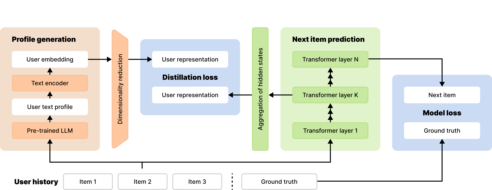

# Pre-trained LLMs Meet Sequential Recommenders: Efficient User-Centric Knowledge Distillation

This repository contains code for the paper ["Pre-trained LLMs Meet Sequential Recommenders: Efficient User-Centric Knowledge Distillation"]()

## Method Overview

Our approach consists of two main components: **LLM-based User Profile Generation** and **Knowledge Distillation to Sequential Recommender Models**. The key innovation is decoupling the recommendation process from LLM inference, making the system production-ready while retaining the benefits of LLM-derived semantic understanding.

### LLM-Based User Profile Generation

We prompt a pre-trained LLM (Gemma-2-9b) using users' interaction history from the training data, providing available textual information about items such as product titles, descriptions, genres, and metadata. The LLM characterizes user preferences and extracts behavioral insights through structured prompting strategies including long-form descriptions and organized profiles with specific sections for preferences, behavioral patterns, and engagement trends.

We obtain vector representations of the generated textual profiles using the E5-large encoder. Since the embedding space typically differs from recommender models, we apply UMAP dimensionality reduction to preserve user relationships and a linear transformation to align textual and recommender spaces.

### Proposed Knowledge Distillation scheme



## Repository Structure

```
LLMProfileDistillation/
├── profile_generation/          # Phase 1: LLM-based user profile generation
│   ├── src/
│   │   ├── datasets/           # Dataset handlers
│   │   └── prompts/            # LLM prompts for profile generation
│   ├── encode.py               # Main script for profile generation
│   ├── encode_descriptions.py  # Script for embedding generation
│   └── README.md               # Detailed guide for profile generation
├── knowledge_transfer/          # Phase 2: Sequential recommendation with knowledge distillation
│   ├── src/
│   │   ├── models/             # Recommendation model implementations
│   │   ├── training.py         # Training script
│   │   ├── evaluation.py       # Evaluation utilities
│   │   └── data_processing.py  # Data preprocessing
│   ├── experiments/
│   │   └── configs/            # Configuration files for experiments
│   ├── data/                   # Dataset storage
│   └── requirements.txt        # Python dependencies
└── README.md                   # This file
```

We evaluate our method on four diverse datasets spanning different domains, scales, and textual richness to ensure comprehensive evaluation across various recommendation scenarios.
Each dataset should follow this structure:

```
data/
├── <dataset_name>/
│   ├── raw/
│   │   ├── users.csv
│   │   ├── items.csv
│   │   └── interactions.csv
│   └── processed/
```

## Main Results

Our method consistently outperforms baseline approaches across all datasets:

### Performance Comparison: SASRec vs SASRec + LLM Distillation

| Dataset | Model | Recall@10 | NDCG@10 | Improvement |
|---------|--------|-----------|---------|-------------|
| **Beauty** | SASRec | 0.0217 ± 0.0013 | 0.0106 ± 0.0004 | - |
| | SASRec + LLM Distillation | **0.0228 ± 0.0004** | **0.0111 ± 0.0002** | +5.20% / +4.90% |
| **ML-20M** | SASRec | 0.0781 ± 0.0093 | 0.0453 ± 0.0062 | - |
| | SASRec + LLM Distillation | **0.0819 ± 0.0019** | **0.0479 ± 0.0007** | +4.74% / +5.62% |
| **Kion** | SASRec | 0.1135 ± 0.0009 | 0.0585 ± 0.0009 | - |
| | SASRec + LLM Distillation | **0.1145 ± 0.0007** | **0.0597 ± 0.0005** | +0.94% / +2.02% |
| **Amazon M2** | SASRec | 0.5373 ± 0.0123 | 0.3647 ± 0.0071 | - |
| | SASRec + LLM Distillation | **0.5414 ± 0.0051** | **0.3761 ± 0.0041** | +0.75% / +3.14% |

Our method consistently improves SASRec performance across all datasets, with particularly notable gains on Beauty and ML-20M datasets. The improvements demonstrate the effectiveness of LLM-derived user knowledge for enhancing sequential recommendation quality.

### Performance Comparison: BERT4Rec vs BERT4Rec + LLM Distillation

| Dataset | Model | Recall@10 | NDCG@10 | Improvement |
|---------|--------|-----------|---------|-------------|
| **Beauty** | BERT4Rec | 0.0102 ± 0.0004 | 0.0051 ± 0.0004 | - |
| | BERT4Rec + LLM Distillation | **0.0126 ± 0.0008** | **0.0061 ± 0.0005** | +23.53% / +19.61% |
| **ML-20M** | BERT4Rec | 0.1088 ± 0.0008 | 0.0623 ± 0.0001 | - |
| | BERT4Rec + LLM Distillation | **0.1099 ± 0.0029** | **0.0628 ± 0.0014** | +1.01% / +0.80% |
| **Kion** | BERT4Rec | 0.1101 ± 0.0018 | 0.0574 ± 0.0011 | - |
| | BERT4Rec + LLM Distillation | **0.1149 ± 0.0008** | **0.0596 ± 0.0009** | +4.36% / +3.83% |
| **Amazon M2** | BERT4Rec | 0.4230 ± 0.0013 | 0.2699 ± 0.0018 | - |
| | BERT4Rec + LLM Distillation | **0.4267 ± 0.0019** | **0.2727 ± 0.0020** | +0.87% / +1.04% |

BERT4Rec shows even more dramatic improvements, especially on the Beauty dataset with over 20% gains. This suggests our distillation approach is particularly effective for models that struggle with baseline performance, helping to bridge architectural limitations through LLM-derived semantic understanding.

## Configuration

Configuration files in `knowledge_transfer/experiments/configs/` control model architecture (SASRec, BERT4Rec, etc.), training hyperparameters, knowledge distillation settings, and evaluation metrics.

**Profile Generation Parameters**: Use `--dataset` for dataset name, `--llm` for LLM choice (openai, gemma2-9b), `--prompts-type` for profile format (long, short), and `--long-gen-strategy` for aggregation strategy (agg_after, agg_with).

## Detailed Usage

For detailed instructions on each component, see `profile_generation/README.md` for profile generation and `knowledge_transfer/README.md` for knowledge transfer training.

## Reproduction

To reproduce our results, follow these three main steps: install dependencies, generate user profiles with LLMs, and train models with knowledge distillation.

### Install Dependencies

```bash
pip install -r knowledge_transfer/requirements.txt
```

### Generate User Profiles

```bash
cd profile_generation

# Generate user profiles using LLM
python encode.py --dataset='beauty' \
                 --dataset-path='../data/amazon_beauty' \
                 --llm='gemma2-9b' \
                 --descriptions-path='./output' \
                 --long-gen-strategy="agg_after" \
                 --max_output_tokens=1000

# Convert profiles to embeddings
python encode_descriptions.py --embedder="e5" \
                              --descriptions-path="data/descriptions.json" \
                              --embeddings-path="data/embeddings.json"
```

### Train Models

```bash
cd knowledge_transfer

# Train enhanced model with LLM distillation
python -m src.training --config experiments/configs/sasrec_llm.yaml

# Train baseline model for comparison
python -m src.training --config experiments/configs/sasrec.yaml
```

All configuration files and detailed instructions are available in the respective README files within each directory.

## Citation

If you find this work useful for your research, please cite our paper:

```bibtex
@article{severin2026pretrained,
  title={Pre-trained LLMs Meet Sequential Recommenders: Efficient User-Centric Knowledge Distillation},
  author={Severin, Nikita and Kartushov, Danil and Urzhumov, Vladislav and Kulikov, Vladislav and Konovalova, Oksana and Grishanov, Alexey and Klenitskiy, Anton and Fatkulin, Artem and Vasilev, Alexey and Savchenko, Andrey and Makarov, Ilya},
  booktitle={The 48th European Conference on Information Retrieval (ECIR)},
  year={2026}
}
```

## License

This project is licensed under the MIT License - see the LICENSE file for details.
